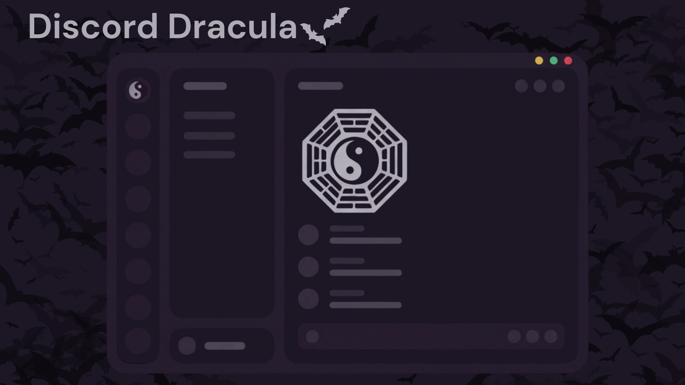

# Dracula for [Discord, Vesktop, Vencord](https://discord.com)

> A dark theme for [Discord](https://discord.com).

## Install

All instructions can be found at [draculatheme.com/Vesktop](https://draculatheme.com/Vesktop).

## Team

This theme is maintained by the following person(s) and a bunch of [awesome contributors](https://github.com/dracula/discord/graphs/contributors).

|  |
| ---------------------------------------------------------------------------------------- | 
| [CtorW](https://github.com/CtorW)                                               | 
## Community

- [Twitter](https://twitter.com/draculatheme) - Best for getting updates about themes and new stuff.
- [GitHub](https://github.com/dracula/dracula-theme/discussions) - Best for asking questions and discussing issues.
- [Discord](https://draculatheme.com/discord-invite) - Best for hanging out with the community.

## Dracula PRO

## License

[MIT License](./LICENSE)
